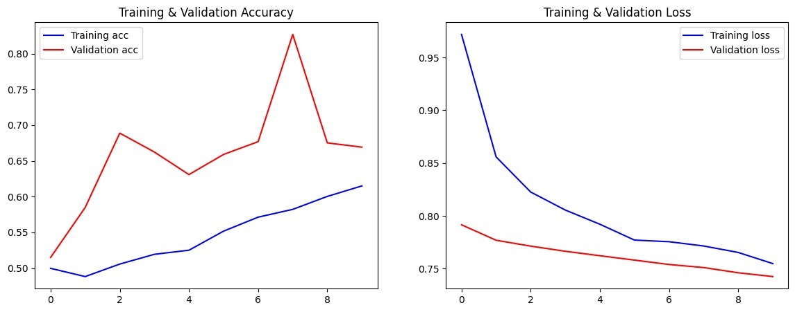
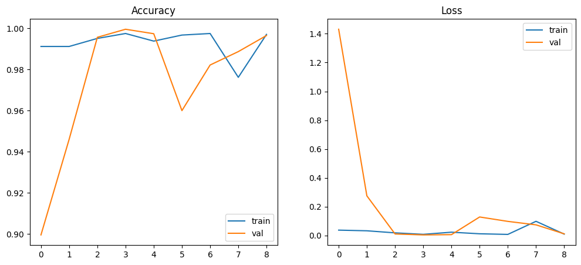

# Traffic Light Classification with ResNet-50

## Overview
This project implements a traffic light classification model using the ResNet-50 architecture to classify traffic light states into three classes: **Go**, **Stop**, and **Warning**. The model is trained on the [LISA Traffic Light Dataset](https://www.kaggle.com/datasets/mbornoe/lisa-traffic-light-dataset), which contains annotated images of traffic lights captured in various conditions.

## Dataset
The **LISA Traffic Light Dataset** from Kaggle is used for training and evaluation. Below are the detailed characteristics of the dataset:

- **Source**: [LISA Traffic Light Dataset](https://www.kaggle.com/datasets/mbornoe/lisa-traffic-light-dataset) by Mikkel Bornoe.
- **Content**:
  - **Images**: Approximately 43,007 images with 113,888 annotated traffic lights captured in urban environments.
  - **Sequences**: The dataset is divided into day and night sequences:
    - **daySequence1**: Daytime images with annotations for traffic light states.
    - **daySequence2**: Additional daytime images with similar annotations.
    - **dayClip1 to dayClip13**: Short video clips (extracted frames) capturing daytime traffic light sequences.
    - **nightSequence1**: Nighttime images with annotations.
    - **nightSequence2**: Additional nighttime images.
    - **nightClip1 to nightClip5**: Short video clips (extracted frames) capturing nighttime traffic light sequences.
  - **Annotations**: Provided in CSV files, including:
    - Filename of the image.
    - Bounding box coordinates (x_min, y_min, x_max, y_max) for traffic lights.
    - Class labels: `go`, `stop`, `warning`, or `none` (for images without a clear traffic light state).
  - **Classes**: The project focuses on three classes:
    - **Go**: Green light, indicating vehicles can proceed.
    - **Stop**: Red light, indicating vehicles must stop.
    - **Warning**: Yellow light, indicating caution or preparation to stop.
  - **Image Format**: PNG files.
  - **Resolution**: Varies (typically 1280x960 pixels).
  - **Conditions**: Images capture diverse conditions, including different lighting (day, night), weather, and angles.
- **Size**: The dataset occupies approximately 5.7 GB when extracted.
- **Directory Structure**:
  ```
  dataset/
  ├── daySequence1/
  ├── daySequence2/
  ├── dayClip1/
  ├── ...
  ├── dayClip9/
  ├── nightSequence1/
  ├── nightSequence2/
  ├── nightClip1/
  ├── ...
  ├── nightClip5/
  ├── Annotations/
  │   ├── daySequence1.csv
  │   ├── daySequence2.csv
  │   ├── nightSequence1.csv
  │   ├── nightSequence2.csv
  │   ├── dayClips.csv
  │   ├── nightClips.csv
  ```
- **Usage**: The dataset is split into training, validation, and test sets during preprocessing. Images are resized to 224x224 pixels to match ResNet-50 input requirements.

Download the dataset from [Kaggle](https://www.kaggle.com/datasets/mbornoe/lisa-traffic-light-dataset) and extract it into the `data/` directory.

Install dependencies using:
```bash
pip install tensorflow numpy pandas opencv-python matplotlib scikit-learn
```

## Project Structure
```
traffic-light-classification/
│
├── lisa_raw/                  # Directory for extracted dataset
├── processed/                 # Directory for cropped& preprocessed dataset
├── dataset/                   # Directory for Ready to use dataset
├── models/                    # Directory for save trained models
├── visuals/                   # Directory for saved plots& curves
├── notebooks/                 # Directory for Jupyter notebooks for data exploration and analysis
├── README.md                  # Project documentation
```

## Setup
1. **Clone the Repository**:
   ```bash
   git clone https://github.com/3omd4/traffic-light-classifier.git
   cd traffic-light-classification
   ```

2. **Download the Dataset**:
   - Download the LISA Traffic Light Dataset from [Kaggle](https://www.kaggle.com/datasets/mbornoe/lisa-traffic-light-dataset).
   - Extract the dataset into the `data/` directory.

3. **Install Dependencies**:
   ```bash
   pip install -r requirements.txt
   ```

## Usage
1. **Preprocess the Data**:
   Run the preprocessing script to prepare the dataset for training:
   ```bash
   python src/preprocess.py
   ```
   This script resizes images, normalizes pixel values, and splits the data into training, validation, and test sets.

2. **Train the Model**:
   Train the ResNet-50 model using:
   ```bash
   python src/train.py
   ```
   The script loads the preprocessed data, fine-tunes ResNet-50, and saves the trained model to the `models/` directory.

3. **Evaluate the Model**:
   Evaluate the model's performance on the test set:
   ```bash
   python src/evaluate.py
   ```
   This generates metrics such as accuracy, precision, recall, and a confusion matrix.

## Model Details
- **Architecture**: ResNet-50 (pre-trained on ImageNet, fine-tuned for traffic light classification).
- **Input**: Images resized to 224x224 pixels.
- **Output**: Classification into three classes: `go`, `stop`, `warning`.
- **Training**:
  - Optimizer: Adam
  - Loss: Categorical Crossentropy
  - Batch Size: 32
  - Epochs: 50
  - early_stopping: patience=5

### Model Versions
- **Version 1**:
  - **Only Using**: `daySequence1` and `daySequence2`.
  - **Description**: The initial model was trained on a subset of the dataset, focusing on daytime sequences. It achieved moderate performance but was limited by the smaller dataset size and lack of diversity in lighting conditions.

- **Version 2**:
  - **Only Using**: `daySequence1`, `daySequence2`, `dayClip1`, `dayClip2`, `dayClip3`, `dayClip4`, `dayClip5`.
  - **Description**: The improved model incorporates additional daytime clips, significantly increasing the dataset size and diversity. This led to a substantial improvement in accuracy, making the model more robust for daytime scenarios.

## Training Curves
The following plots show the model's performance during training:





## Contributing
Contributions are welcome! Please:
1. Fork the repository.
2. Create a new branch (`git checkout -b feature-branch`).
3. Submit a pull request with a clear description of changes.

## License
This project is licensed under the MIT License. See the [LICENSE](LICENSE) file for details.

## Acknowledgments
- [LISA Traffic Light Dataset](https://www.kaggle.com/datasets/mbornoe/lisa-traffic-light-dataset) by Mikkel Bornoe.
- TensorFlow/Keras for providing the ResNet-50 implementation.
